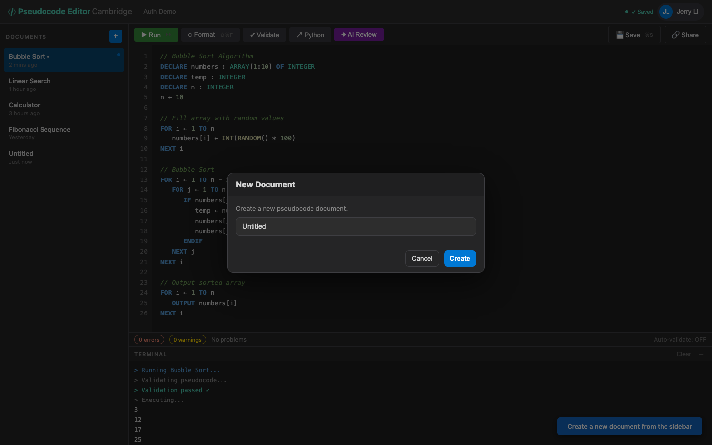

# US-1.2 · Create a new document
**As a** student,
**I want to** create a new blank pseudocode document from the sidebar,
**so that** I can start writing a fresh program.

**Acceptance Criteria:**
- [ ] A "New Document" button (or `+` icon) is visible in the sidebar
- [ ] Clicking it creates a new document titled "Untitled" with empty content
- [ ] The new document is immediately selected and the editor clears
- [ ] The document appears in the sidebar list
- [ ] If the current document has unsaved changes, a confirmation prompt appears

## Backend Requirements

| Endpoints touched | DB impact | Services | Auth |
|---|---|---|---|
| `EXISTING POST /api/pseudocode` | None in Phase 1 (in-memory). In Phase 2 the same create flo… | On create, backend currently auto-formats content; ensure e… | None in Phase 1; post-Phase 2 requires JWT and sets `ownerI… |

- **API endpoints:** No new endpoint is strictly required if “new document” is a client-side draft until the first save. If the product chooses to create immediately on the server, use the existing create endpoint:
  - `POST /api/pseudocode`
    - Request: `{ "title": "Untitled", "content": "", "language": "pseudocode" }` (note: backend expects `content`, not `code`).
    - Response: `201 Created` → `PseudocodeDocument`.
- **Database:** None in Phase 1 (in-memory). In Phase 2 the same create flow must write to `Documents` table.
- **Service layer logic:** On create, backend currently auto-formats content; ensure empty content stays empty and `updatedAt`/`createdAt` are set server-side.
- **Authentication/authorization:** None in Phase 1; post-Phase 2 requires JWT and sets `ownerId` from the authenticated user.
- **Error handling / status codes:** `400 Bad Request` for invalid payloads; `201 Created` on success.

**Traces to:** FR-7.2, FR-7.3, Task 1.3

## Screenshot

