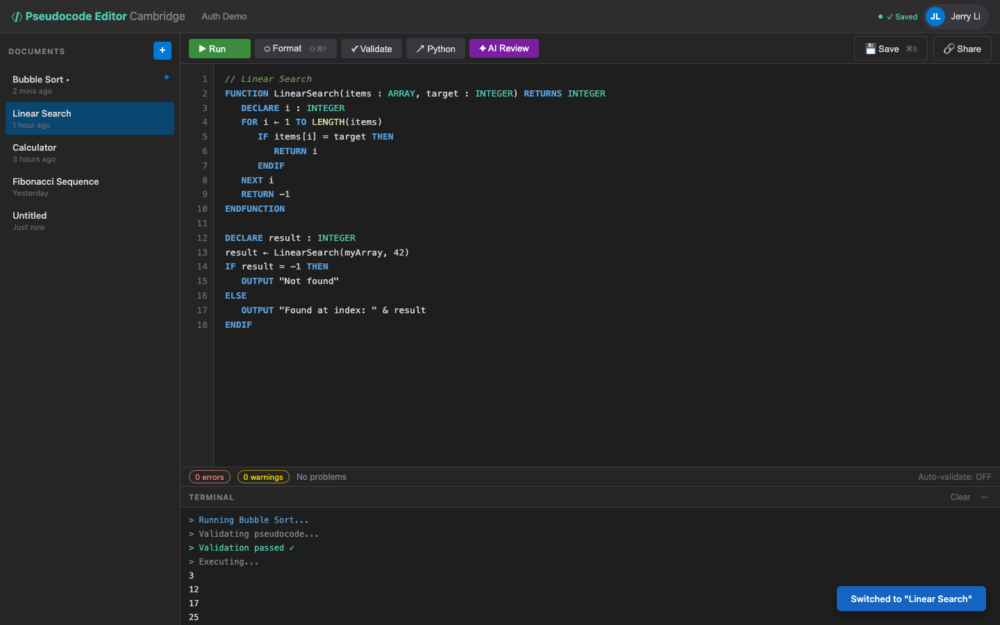

# US-1.3 · View and switch between saved documents
**As a** student,
**I want to** see a list of my documents in a sidebar and click one to open it,
**so that** I can work on multiple programs across sessions.

**Acceptance Criteria:**
- [ ] The sidebar shows a scrollable list of documents with titles and last-modified timestamps
- [ ] Clicking a document loads its content into the editor
- [ ] The currently open document is highlighted in the sidebar
- [ ] Documents are sorted by last modified (most recent first)
- [ ] An empty state message appears when there are no documents

## Backend Requirements

| Endpoints touched | DB impact | Services | Auth |
|---|---|---|---|
| `EXISTING GET /api/pseudocode`; `EXISTING GET /api/pseudocode/{id}` | None in Phase 1; Phase 2 moves storage to EF Core + DB | Ensure `updatedAt` changes on update/rename so “last modifi… | None in Phase 1; Phase 2 requires JWT and filters list by `… |

- **API endpoints:** Use existing read endpoints:
  - `GET /api/pseudocode` → `200 OK` with `PseudocodeDocument[]` (client may sort by `updatedAt`).
  - Optional (if the UI loads content lazily): `GET /api/pseudocode/{id}` → `200 OK` with `PseudocodeDocument` or `404 Not Found`.
- **Database:** None in Phase 1; Phase 2 moves storage to EF Core + DB.
- **Service layer logic:** Ensure `updatedAt` changes on update/rename so “last modified” is meaningful.
- **Authentication/authorization:** None in Phase 1; Phase 2 requires JWT and filters list by `ownerId`.
- **Error handling / status codes:** `404` when a document id doesn’t exist; `500` for unexpected errors.

**Traces to:** FR-7.3, Task 1.3, 1.4

## Screenshot

