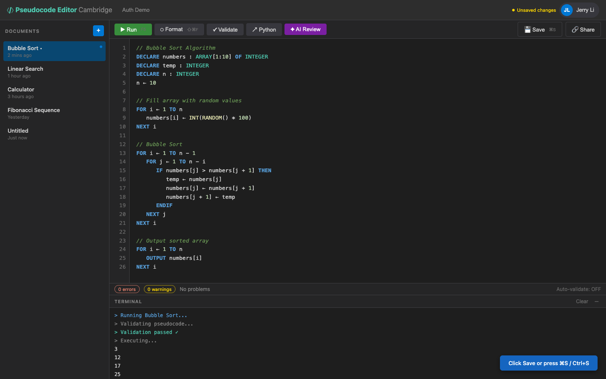

# US-1.4 · Save a document
**As a** student,
**I want to** save my current code to the server by clicking "Save" or pressing Ctrl+S,
**so that** I don't lose my work.

**Acceptance Criteria:**
- [ ] A "Save" button is visible in the control bar
- [ ] For a new document, saving calls `POST /api/pseudocode` and stores the returned ID
- [ ] For an existing document, saving calls `PUT /api/pseudocode/{id}`
- [ ] A visual indicator shows "Saving..." → "Saved ✓" with a brief green flash
- [ ] The sidebar updates the document's title and timestamp after save
- [ ] An unsaved-changes indicator (e.g. dot on tab/title) appears when content differs from last save

## Backend Requirements

| Endpoints touched | DB impact | Services | Auth |
|---|---|---|---|
| `EXISTING POST /api/pseudocode`; `EXISTING PUT /api/pseudocode/{id}` | None in Phase 1; Phase 2 persists these writes to DB | Backend currently validates + auto-formats on create/update… | None in Phase 1; post-Phase 2, require JWT and enforce `own… |

- **API endpoints:** Use existing create/update endpoints:
  - `POST /api/pseudocode`
    - Request: `{ "title": string, "content": string, "language": "pseudocode" }` (backend expects `content`; known gap: some clients send `code`).
    - Response: `201 Created` → `PseudocodeDocument`.
  - `PUT /api/pseudocode/{id}`
    - Request: `{ "title": string, "content": string, "language": "pseudocode" }`.
    - Response: `200 OK` → `PseudocodeDocument` or `404 Not Found`.
- **Database:** None in Phase 1; Phase 2 persists these writes to DB.
- **Service layer logic:** Backend currently validates + auto-formats on create/update; ensure formatting is Cambridge-compliant and `updatedAt` is set on each save.
- **Authentication/authorization:** None in Phase 1; post-Phase 2, require JWT and enforce `ownerId`.
- **Error handling / status codes:** `400` for invalid payload; `404` if updating missing id; `500` for unexpected.

**Traces to:** FR-7.2, Task 1.4

## Screenshot

