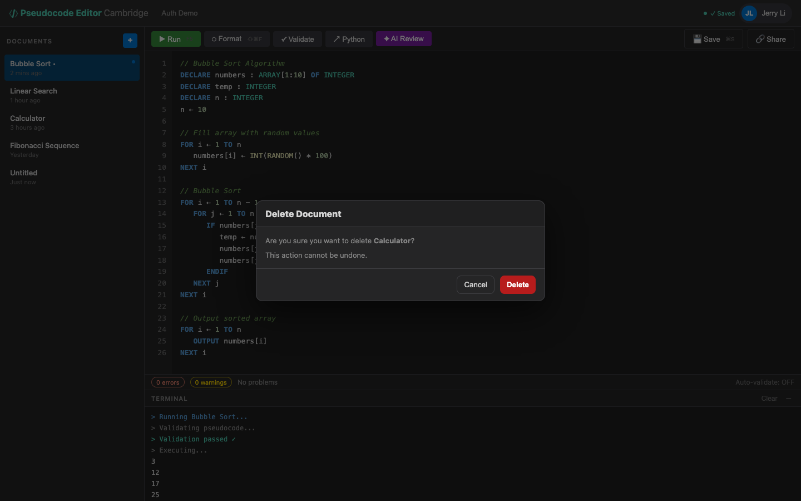

# US-1.5 · Delete a document
**As a** student,
**I want to** delete a document I no longer need,
**so that** my document list stays manageable.

**Acceptance Criteria:**
- [ ] Each document in the sidebar has a delete action (icon or context menu)
- [ ] Clicking delete shows a confirmation dialog: "Delete '{title}'? This cannot be undone."
- [ ] Confirming calls `DELETE /api/pseudocode/{id}` and removes it from the sidebar
- [ ] If the deleted document was open, the editor switches to the next document or shows empty state
- [ ] A toast notification confirms "Document deleted"

## Backend Requirements

| Endpoints touched | DB impact | Services | Auth |
|---|---|---|---|
| `EXISTING DELETE /api/pseudocode/{id}` | None in Phase 1 (in-memory). In Phase 2, delete must remove… | Delete should be idempotent from the client’s perspective;… | None in Phase 1; post-Phase 2 require JWT and ensure user c… |

- **API endpoints:** Use existing delete endpoint:
  - `DELETE /api/pseudocode/{id}` → `204 No Content` on success, `404 Not Found` if id doesn’t exist.
- **Database:** None in Phase 1 (in-memory). In Phase 2, delete must remove the row from `Documents`.
- **Service layer logic:** Delete should be idempotent from the client’s perspective; recommended to return `404` for unknown ids.
- **Authentication/authorization:** None in Phase 1; post-Phase 2 require JWT and ensure user can only delete their own document (return `403 Forbidden` per US-2.5).
- **Error handling / status codes:** `204`, `404`, `401/403` once auth is enabled, and `500` for unexpected errors.

**Traces to:** FR-7.3, Task 1.3

## Screenshot

