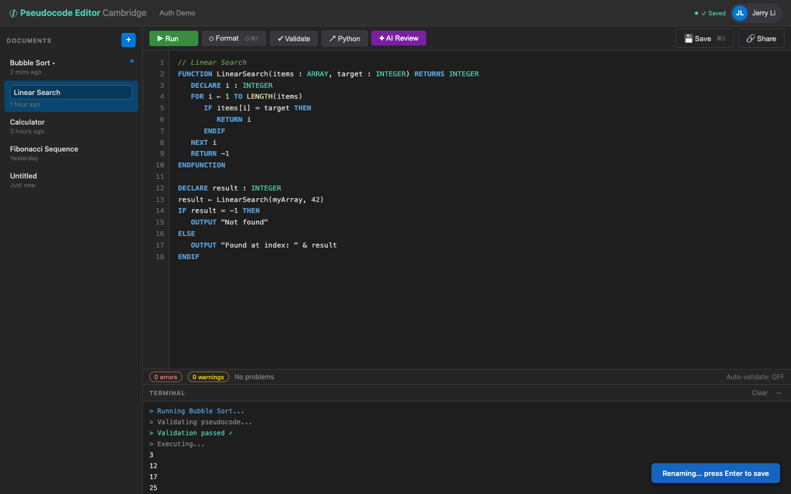

# US-1.6 · Rename a document
**As a** student,
**I want to** rename a document by double-clicking its title in the sidebar,
**so that** I can give meaningful names to my programs.

**Acceptance Criteria:**
- [ ] Double-clicking a document title in the sidebar makes it editable (inline text input)
- [ ] Pressing Enter or clicking away saves the new title via `PUT /api/pseudocode/{id}`
- [ ] Pressing Escape cancels the rename
- [ ] Empty titles default to "Untitled"
- [ ] The header/tab area reflects the renamed title immediately

## Backend Requirements

| Endpoints touched | DB impact | Services | Auth |
|---|---|---|---|
| `EXISTING PUT /api/pseudocode/{id}` | None in Phase 1; Phase 2 persists title changes and updates… | Enforce server-side default title if empty/whitespace (`"Un… | None in Phase 1; post-Phase 2, require JWT and enforce owne… |

- **API endpoints:** Use existing update endpoint:
  - `PUT /api/pseudocode/{id}`
    - Request: `{ "title": string, "content": string, "language": "pseudocode" }` (client should send the existing `content` unchanged when doing a title-only rename).
    - Response: `200 OK` → updated `PseudocodeDocument`.
- **Database:** None in Phase 1; Phase 2 persists title changes and updates `updatedAt`.
- **Service layer logic:** Enforce server-side default title if empty/whitespace (`"Untitled"`). Ensure rename updates `updatedAt` so sort-by-last-modified works.
- **Authentication/authorization:** None in Phase 1; post-Phase 2, require JWT and enforce ownership.
- **Error handling / status codes:** `400` for invalid title, `404` if id not found, `500` otherwise.

**Traces to:** FR-7.3, Task 1.3

## Screenshot

