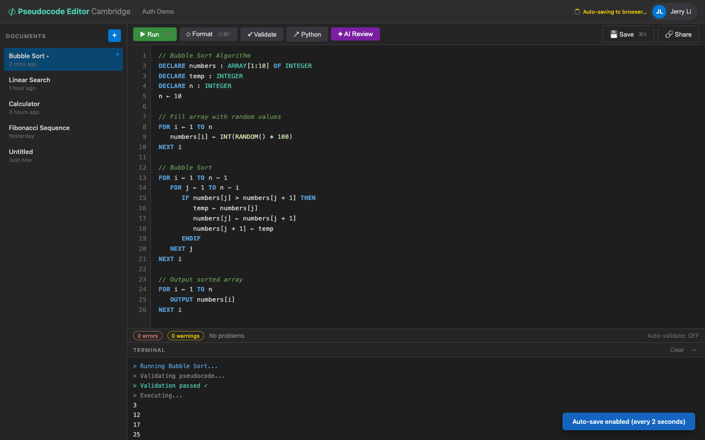

# US-1.7 · Auto-save to localStorage
**As a** student,
**I want** my code to be automatically saved to the browser every 2 seconds,
**so that** I don't lose work if I accidentally close the tab or lose internet.

**Acceptance Criteria:**
- [ ] Editor content is saved to `localStorage` every 2 seconds (debounced from last keystroke)
- [ ] On page load, if localStorage has unsaved content, it is restored into the editor
- [ ] A small "Auto-saved locally" indicator is shown (e.g. in the status bar)
- [ ] localStorage data is cleared after a successful server save

## Backend Requirements

| Endpoints touched | DB impact | Services | Auth |
|---|---|---|---|
| `EXISTING POST /api/pseudocode`; `EXISTING PUT /api/pseudocode/{id}` | None in Phase 1 | Save endpoints must remain idempotent and return updated `u… | None in Phase 1; post-Phase 2 the save endpoints require JWT |

- **API endpoints:** No new endpoints. Clearing local drafts is triggered by a successful response from existing save endpoints (`POST /api/pseudocode`, `PUT /api/pseudocode/{id}`).
- **Database:** None in Phase 1.
- **Service layer logic:** Save endpoints must remain idempotent and return updated `updatedAt` so the UI can show correct “saved” state.
- **Authentication/authorization:** None in Phase 1; post-Phase 2 the save endpoints require JWT.
- **Error handling / status codes:** On save failures, backend returns `4xx/5xx` and client keeps localStorage draft intact.

**Traces to:** FR-7.8, Task 1.5

## Screenshot

