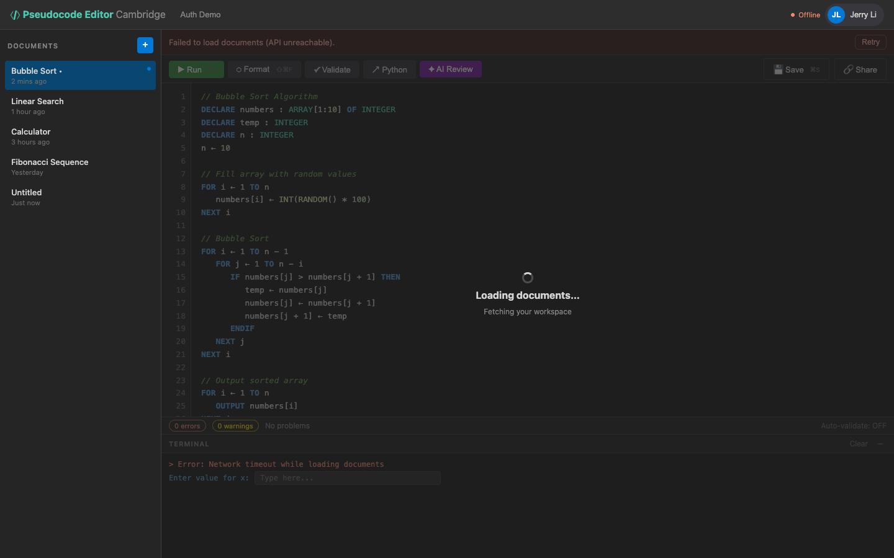

# US-1.8 · Loading and error states
**As a** student,
**I want** clear feedback when the app is loading or encounters an error,
**so that** I know what's happening and don't think the app is broken.

**Acceptance Criteria:**
- [ ] A spinner or skeleton UI shows while documents are loading from the API
- [ ] API errors display a toast notification with a human-readable message
- [ ] Network disconnection shows a persistent banner: "Offline — changes saved locally"
- [ ] Buttons are disabled during async operations to prevent double-clicks

## Backend Requirements

| Endpoints touched | DB impact | Services | Auth |
|---|---|---|---|
| `EXISTING POST /api/pseudocode/validate`; `EXISTING POST /api/pseudocode/format` | None in Phase 1 | Prefer consistent server-side validation messages (e.g., fo… | None in Phase 1; Phase 2 introduces `401`/`403` flows that… |

- **API endpoints:** No new endpoints. This story relies on existing endpoints returning consistent status codes and error bodies.
- **Database:** None in Phase 1.
- **Service layer logic:** Prefer consistent server-side validation messages (e.g., for `POST/PUT /api/pseudocode`, `POST /api/pseudocode/validate`, `POST /api/pseudocode/format`) so the UI can display human-readable toasts.
- **Authentication/authorization:** None in Phase 1; Phase 2 introduces `401`/`403` flows that must map to “session expired” UI.
- **Error handling / status codes:**
  - `400 Bad Request` for validation errors (malformed requests)
  - `404 Not Found` for missing document IDs
  - `401 Unauthorized` for missing/invalid JWT (post-Phase 2)
  - `403 Forbidden` for ownership violations (post-Phase 2)
  - `500 Internal Server Error` for unexpected failures; prefer RFC7807 `ProblemDetails`

**Traces to:** Task 1.7

## Screenshot

