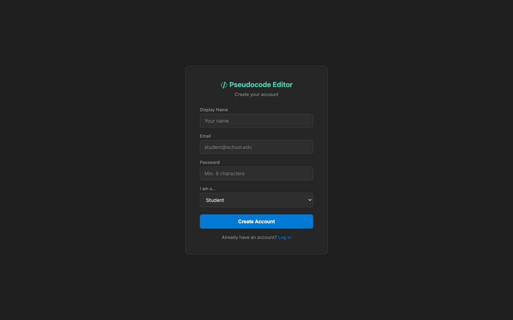

# US-2.1 · Register an account
**As a** new user,
**I want to** create an account with my email and a password,
**so that** my documents are saved to my personal account.

**Acceptance Criteria:**
- [ ] A "Sign Up" page is accessible from the header or landing page
- [ ] The form requires: email (valid format), display name, password (min 8 chars)
- [ ] Submitting calls `POST /api/auth/register` and returns a JWT token
- [ ] Duplicate email shows: "An account with this email already exists"
- [ ] On success, the user is redirected to the editor with their token stored
- [ ] The token is stored in `localStorage` and attached to all subsequent API requests

## Backend Requirements

| Endpoints touched | DB impact | Services | Auth |
|---|---|---|---|
| `NEW POST /api/auth/register` | Phase 2 introduces persistent storage (Tasks 2.1–2.4) and I… | Validate email format + uniqueness; enforce password policy… | Registration endpoint is anonymous; subsequent API calls us… |

- **API endpoints:** (new; not currently present in the backend)
  - `POST /api/auth/register`
    - Request: `{ "email": string, "displayName": string, "password": string }`
    - Response: `200 OK` → `{ "token": string, "user": { "id": string, "email": string, "displayName": string } }`
- **Database:** Phase 2 introduces persistent storage (Tasks 2.1–2.4) and Identity (Task 2.5).
  - Add ASP.NET Identity tables (e.g. `AspNetUsers`, roles/claims).
  - If using a custom user type, add `DisplayName` to the user record.
- **Service layer logic:**
  - Validate email format + uniqueness; enforce password policy (≥ 8 chars minimum as per AC).
  - Create user via `UserManager` (password hashing handled by Identity).
  - Generate JWT with stable user identifier claim (e.g. `sub`) for document ownership.
  - Trigger post-registration seeding (see US-2.6 / Task 2.9).
- **Authentication/authorization:** Registration endpoint is anonymous; subsequent API calls use `Authorization: Bearer <jwt>`.
- **Error handling / status codes:**
  - `409 Conflict` for duplicate email
  - `400 Bad Request` for invalid inputs (email/password)
  - `500 Internal Server Error` for unexpected failures

**Traces to:** FR-7.1, Task 2.5, 2.7

## Screenshot

