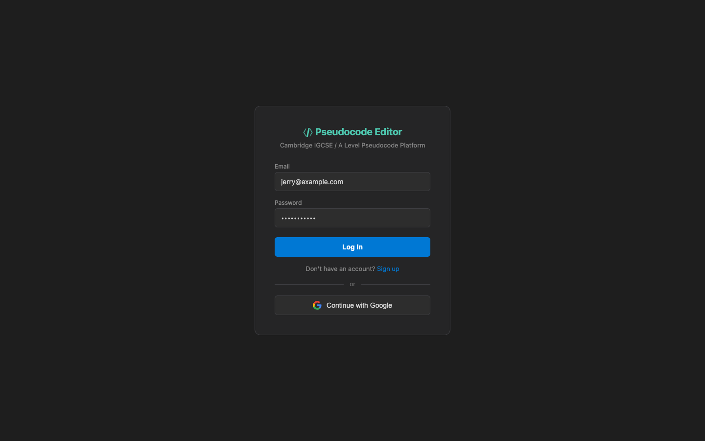

# US-2.2 · Log in to an existing account
**As a** returning user,
**I want to** log in with my email and password,
**so that** I can access my saved documents.

**Acceptance Criteria:**
- [ ] A "Log In" page is accessible from the header
- [ ] The form requires email and password
- [ ] Submitting calls `POST /api/auth/login` and returns a JWT token
- [ ] Wrong credentials show: "Invalid email or password"
- [ ] On success, the user is redirected to the editor and the sidebar loads their documents
- [ ] A "Forgot password" link is visible (can be a placeholder for v1)

## Backend Requirements

| Endpoints touched | DB impact | Services | Auth |
|---|---|---|---|
| `NEW POST /api/auth/login` | Uses ASP.NET Identity user store (Task 2.5). No document sc… | Authenticate using `SignInManager`/`UserManager` | Login endpoint is anonymous |

- **API endpoints:** (new; not currently present in the backend)
  - `POST /api/auth/login`
    - Request: `{ "email": string, "password": string }`
    - Response: `200 OK` → `{ "token": string, "user": { "id": string, "email": string, "displayName": string } }`
- **Database:** Uses ASP.NET Identity user store (Task 2.5). No document schema changes beyond Phase 2 baseline.
- **Service layer logic:**
  - Authenticate using `SignInManager`/`UserManager`.
  - On success, generate JWT signed with server secret and include expiry.
- **Authentication/authorization:** Login endpoint is anonymous.
- **Error handling / status codes:**
  - `401 Unauthorized` for invalid credentials (do not reveal whether email exists)
  - `400 Bad Request` for malformed request
  - `500 Internal Server Error` for unexpected failures

**Traces to:** FR-7.1, Task 2.5, 2.7

## Screenshot

