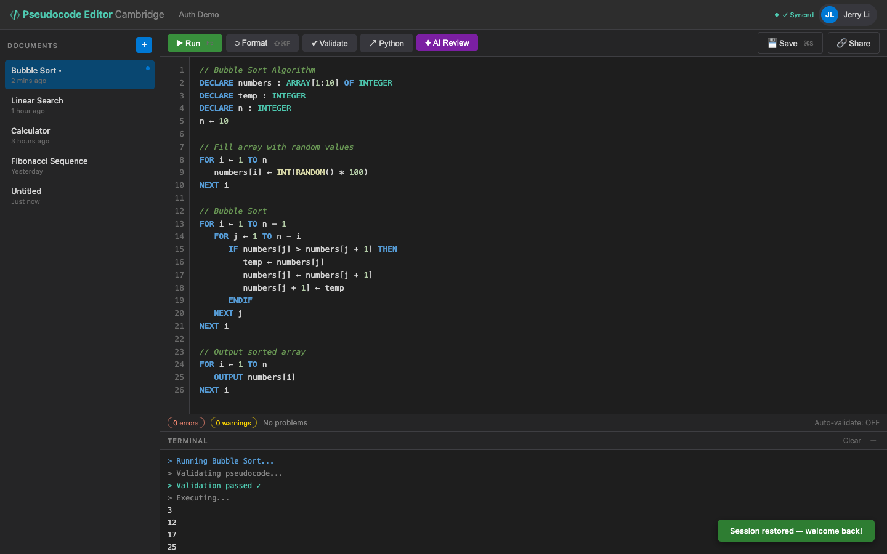

# US-2.3 · Stay logged in across sessions
**As a** user,
**I want to** remain logged in when I close and reopen the browser,
**so that** I don't have to enter my password every time.

**Acceptance Criteria:**
- [ ] The JWT token is persisted in `localStorage`
- [ ] On page load, the app checks for a stored token and calls `GET /api/auth/me` to validate it
- [ ] If the token is valid, the user goes straight to the editor
- [ ] If the token is expired or invalid, the user is redirected to the login page
- [ ] A "Log out" button in the header clears the token and redirects to login

## Backend Requirements

| Endpoints touched | DB impact | Services | Auth |
|---|---|---|---|
| `NEW GET /api/auth/me` | Uses ASP.NET Identity user store | Configure JWT bearer authentication/validation (Task 2.6):… | `GET /api/auth/me` requires `[Authorize]` |

- **API endpoints:** (new; not currently present in the backend)
  - `GET /api/auth/me`
    - Auth: `Authorization: Bearer <jwt>`
    - Response: `200 OK` → `{ "id": string, "email": string, "displayName": string }`
- **Database:** Uses ASP.NET Identity user store.
- **Service layer logic:**
  - Configure JWT bearer authentication/validation (Task 2.6): issuer/audience, signing key, expiry, and clock skew.
  - `GET /api/auth/me` should resolve the current user from claims and confirm the user still exists.
- **Authentication/authorization:**
  - `GET /api/auth/me` requires `[Authorize]`.
  - Logout is client-side (token deletion); no server endpoint required for v1.
- **Error handling / status codes:**
  - `401 Unauthorized` if token is missing/invalid/expired
  - `200 OK` for valid token

**Traces to:** FR-7.1, Task 2.6, 2.8

## Screenshot

