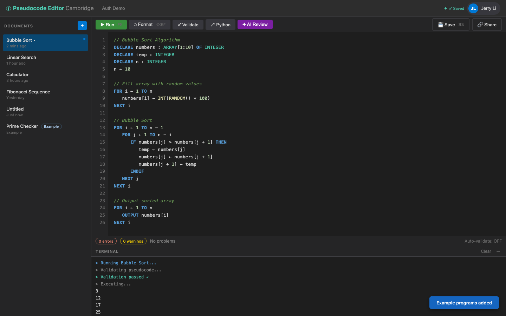

# US-2.6 · Example documents for new users
**As a** new user,
**I want** a few example pseudocode programs in my account when I sign up,
**so that** I can see what the editor does before I start writing my own code.

**Acceptance Criteria:**
- [ ] After registration, the user's account is seeded with 3 example documents
- [ ] Examples cover: a simple OUTPUT program, an IF/ELSE program, and a FOR loop program
- [ ] The examples use correct Cambridge pseudocode syntax
- [ ] The user can edit or delete the example documents like any other document

## Backend Requirements

| Endpoints touched | DB impact | Services | Auth |
|---|---|---|---|
| `NEW POST /api/auth/register` | Persist the 3 seeded rows in `Documents` with `ownerId = ne… | Implement deterministic seed content (Cambridge-compliant k… | Seeding ties documents to the user account; the user must o… |

- **API endpoints:** No new endpoints required; seeding can happen during registration or first authenticated session.
  - If seeding happens during registration (recommended), ensure `POST /api/auth/register` creates the user and the initial documents in one logical flow.
- **Database:** Persist the 3 seeded rows in `Documents` with `ownerId = newUserId`.
- **Service layer logic:**
  - Implement deterministic seed content (Cambridge-compliant keywords, 3-space indentation).
  - Prevent duplicate seeding (e.g., seed only if user has 0 documents, or record a seed marker).
  - Seed documents should be fully normal documents (editable/deletable) using the same formatting/validation pipeline.
- **Authentication/authorization:** Seeding ties documents to the user account; the user must only ever see their own seeds (US-2.5).
- **Error handling / status codes:**
  - If seeding fails after user creation, return a server error and roll back if using a transaction; otherwise ensure the system can recover (e.g., seed on first login).

**Traces to:** Task 2.9

## Screenshot

