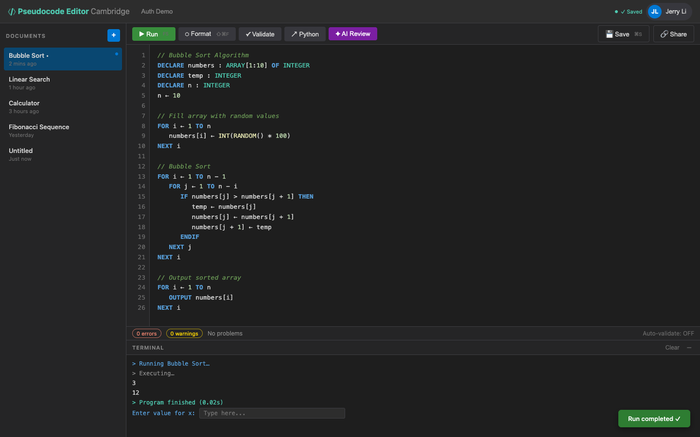

# US-3.1 · Run pseudocode and see output
**As a** student,
**I want to** press "Run" and see the output of my pseudocode in the terminal panel,
**so that** I can verify my program works correctly.

**Acceptance Criteria:**
- [ ] Clicking the "Run" button sends the editor content to `POST /api/pseudocode/execute`
- [ ] OUTPUT statements appear line-by-line in the terminal panel
- [ ] The terminal clears previous output before each run
- [ ] A "Running..." state disables the Run button and shows a spinner
- [ ] On completion, the terminal shows "Program finished" with execution time

## Backend Requirements

| Endpoints touched | DB impact | Services | Auth |
|---|---|---|---|
| `NEW POST /api/pseudocode/execute` | None required for v1 execution (no persistence of runs) | Add an execution service (e.g. `IPseudocodeExecutionService… | If the editor requires login (Phase 2), protect the execute… |

- **API endpoints:** (new; not currently present in the backend)
  - `POST /api/pseudocode/execute`
    - Request: `{ "content": string, "language"?: "pseudocode" }`
    - Response: `200 OK` -> `{ "success": boolean, "events": [{ "kind": "output"|"error"|"system", "text": string, "line"?: number }], "executionTimeMs": number, "awaitingInput"?: boolean, "executionId"?: string }`
    - Note: Use `content` (known gap in some clients: `code` vs `content`).
- **Database:** None required for v1 execution (no persistence of runs).
- **Service layer logic:**
  - Add an execution service (e.g. `IPseudocodeExecutionService`) that lexes/parses and interprets Cambridge-style pseudocode.
  - Enforce safety limits: wall-clock timeout (e.g. 5s) and/or step limit to prevent infinite loops.
  - Capture `OUTPUT` as ordered `events` so the UI can render line-by-line.
- **Authentication/authorization:**
  - If the editor requires login (Phase 2), protect the execute endpoint with `[Authorize]`.
  - Execution must be sandboxed (no filesystem/network access).
- **Error handling / status codes:**
  - `200 OK` with `success=false` for runtime failures (so the UI can still display partial output)
  - `400 Bad Request` for missing/empty `content`
  - `401 Unauthorized` if protected and token missing/invalid

**Traces to:** FR-4.1, Task 3.10, 3.12

## Screenshot

