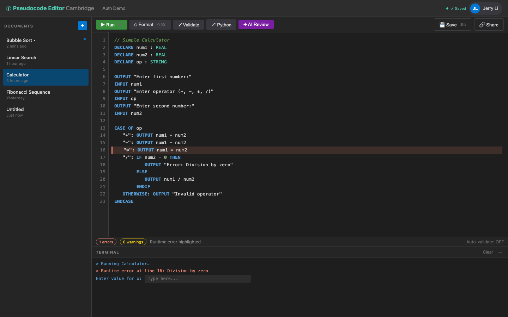

# US-3.2 · See runtime errors with line numbers
**As a** student,
**I want** runtime errors to show the line number and a clear explanation,
**so that** I can find and fix bugs in my code.

**Acceptance Criteria:**
- [ ] Runtime errors display in red in the terminal: `Line X: RuntimeError — {message}`
- [ ] The error line is highlighted in the editor (red background or gutter icon)
- [ ] Common errors have helpful messages:
  - Division by zero: "Cannot divide by zero"
  - Undefined variable: "Variable 'x' has not been declared"
  - Type mismatch: "Cannot add STRING and INTEGER"
  - Array index out of bounds: "Index 11 is out of bounds for ARRAY[1:10]"
- [ ] Execution stops at the first runtime error

## Backend Requirements

| Endpoints touched | DB impact | Services | Auth |
|---|---|---|---|
| `NEW POST /api/pseudocode/execute` | None | Execution engine must track source locations through parse/… | Same as execute endpoint (likely `[Authorize]` after Phase… |

- **API endpoints:** Uses `POST /api/pseudocode/execute` (new; see US-3.1). Runtime errors must be surfaced in the response.
  - Response must include the failing `line` number (1-based) and a stable error kind/code so the UI can highlight the editor line.
  - Example event: `{ "kind": "error", "text": "Line 7: RuntimeError — Cannot divide by zero", "line": 7 }`.
- **Database:** None.
- **Service layer logic:**
  - Execution engine must track source locations through parse/AST evaluation.
  - Stop evaluation on first runtime error and return any output produced before the failure.
  - Provide user-friendly messages for common runtime faults (division by zero, undefined variable, type mismatch, bounds).
- **Authentication/authorization:** Same as execute endpoint (likely `[Authorize]` after Phase 2).
- **Error handling / status codes:**
  - Prefer `200 OK` with `success=false` and structured error details (UI still needs partial output + location)
  - `500` only for unexpected engine bugs (should be treated as server error, not user runtime error)

**Traces to:** FR-4.13, Task 3.3

## Screenshot

