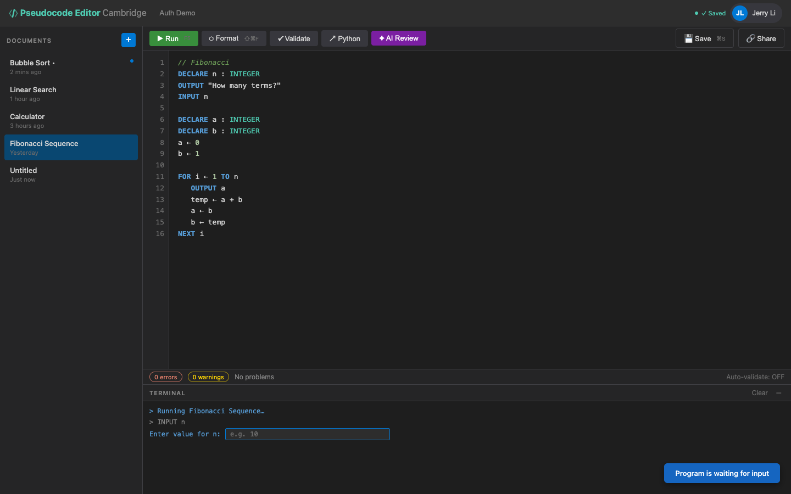

# US-3.7 · Provide user input during execution
**As a** student,
**I want** the program to prompt me for input when it encounters an INPUT statement,
**so that** I can test my program with different values.

**Acceptance Criteria:**
- [ ] When execution hits `INPUT x`, the terminal shows a prompt and an input field
- [ ] The user types a value and presses Enter to continue execution
- [ ] The input value is assigned to the variable with appropriate type conversion
- [ ] If the user enters an invalid type (e.g. "abc" for INTEGER), an error is shown
- [ ] Multiple INPUT statements are handled sequentially
- [ ] Execution pauses (does not timeout) while waiting for input

## Backend Requirements

| Endpoints touched | DB impact | Services | Auth |
|---|---|---|---|
| `NEW POST /api/pseudocode/execute`; `NEW POST /api/pseudocode/execute/{executionId}/input`; `NEW DELETE /api/pseudocode/execute/{executionId}` | None required, but the server must hold in-memory execution… | Execution engine must suspend at `INPUT` and preserve state… | If protected, session ids must be bound to the authenticati… |

- **API endpoints:** Interactive input requires a resumable execution protocol (new; not currently present).
  - `POST /api/pseudocode/execute`
    - If input is required, response includes: `{ "awaitingInput": true, "executionId": string, "prompt": string }`.
  - `POST /api/pseudocode/execute/{executionId}/input`
    - Request: `{ "value": string }`
    - Response: `200 OK` -> same shape as `execute` (may again return `awaitingInput=true` for subsequent INPUT).
  - (Optional) `DELETE /api/pseudocode/execute/{executionId}` to cancel and free server resources.
- **Database:** None required, but the server must hold in-memory execution sessions while awaiting input.
- **Service layer logic:**
  - Execution engine must suspend at `INPUT` and preserve state (stack, variables, program counter).
  - Apply type conversion based on the declared variable type; invalid conversions yield a runtime error.
  - Waiting for input should not consume the normal execution timeout; instead apply a separate session TTL (e.g. 5 minutes).
- **Authentication/authorization:** If protected, session ids must be bound to the authenticating user (prevent cross-user resume).
- **Error handling / status codes:**
  - `404 Not Found` for unknown/expired `executionId`
  - `409 Conflict` if input is provided when not awaiting input
  - `400 Bad Request` for missing value

**Traces to:** FR-4.2, Task 3.8

## Screenshot

