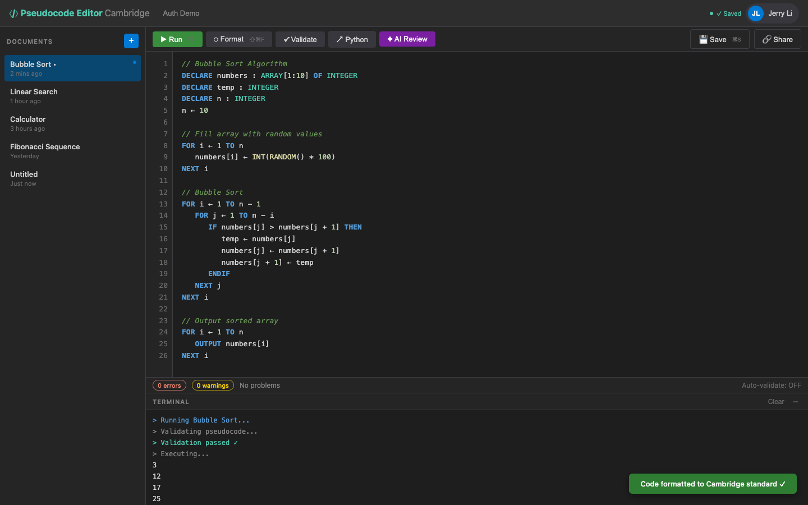

# US-4.1 · Format code with one click
**As a** student,
**I want to** click a "Format" button to auto-format my pseudocode,
**so that** my code follows Cambridge standard formatting without manual effort.

**Acceptance Criteria:**
- [ ] A "Format" button (with icon) is visible in the control bar
- [ ] Clicking it sends content to `POST /api/pseudocode/format` and replaces the editor text with the response
- [ ] Keywords are uppercased (e.g. `if` → `IF`)
- [ ] Indentation is normalised to 3-space multiples
- [ ] String literals and comments are not modified
- [ ] The cursor position is preserved (or restored to approximately the same location)
- [ ] An undo step is added so the user can Ctrl+Z to revert

## Backend Requirements

| Endpoints touched | DB impact | Services | Auth |
|---|---|---|---|
| `EXISTING POST /api/pseudocode/format` | None | Use the existing formatting pipeline (`IPseudocodeFormattin… | If the app requires login after Phase 2, protect with `[Aut… |

- **API endpoints:** (already exists)
  - `POST /api/pseudocode/format`
    - Request: `{ "content": string }`
    - Response: `200 OK` → `{ "formattedContent": string }`
    - Note: Use `content` (known gap in some clients: `code` vs `content`).
- **Database:** None.
- **Service layer logic:**
  - Use the existing formatting pipeline (`IPseudocodeFormattingService`).
  - Formatting rules must be Cambridge-aligned and **must not** mutate comment text or string literals (treat them as tokens).
  - Keep formatting idempotent (formatting an already-formatted document should produce the same output).
- **Authentication/authorization:**
  - If the app requires login after Phase 2, protect with `[Authorize]` and validate the JWT.
- **Error handling / status codes:**
  - `400 Bad Request` for missing/empty `content`
  - `200 OK` for successful formatting (even if no changes)

**Traces to:** FR-3.1, Task 4.1

## Screenshot

