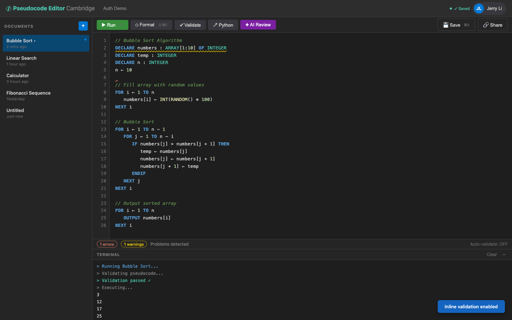

# US-4.2 · See validation errors inline in the editor
**As a** student,
**I want to** see red and yellow squiggles on lines with errors and warnings,
**so that** I can spot problems without reading the terminal.

**Acceptance Criteria:**
- [ ] Validation errors show as red underlines on the affected line(s)
- [ ] Validation warnings show as yellow underlines
- [ ] Hovering over a squiggle shows a tooltip with the error/warning message
- [ ] The gutter (line number area) shows error (🔴) or warning (🟡) icons
- [ ] Markers are cleared and refreshed each time validation runs
- [ ] Clicking on an error in the terminal scrolls the editor to that line

## Backend Requirements

| Endpoints touched | DB impact | Services | Auth |
|---|---|---|---|
| `EXISTING POST /api/pseudocode/validate` | None | Use the existing validation pipeline (`IPseudocodeValidatio… | If the app requires login after Phase 2, protect with `[Aut… |

- **API endpoints:** (already exists)
  - `POST /api/pseudocode/validate`
    - Request: `{ "content": string }`
    - Response: `200 OK` → `{
      "isValid": boolean,
      "errors": Array<{ "lineNumber": number, "message": string, "code": string }>,
      "warnings": Array<{ "lineNumber": number, "message": string, "code": string }>
    }`
    - Note: Use `content` (known gap in some clients: `code` vs `content`).
- **Database:** None.
- **Service layer logic:**
  - Use the existing validation pipeline (`IPseudocodeValidationService`).
  - Ensure validation returns **stable `lineNumber` values** (1-based) and **stable `code` values** so the frontend can map to Monaco markers.
  - Keep the validation fast enough to be called frequently (supports US-4.3 real-time validation).
- **Authentication/authorization:**
  - If the app requires login after Phase 2, protect with `[Authorize]`.
- **Error handling / status codes:**
  - `400 Bad Request` for missing/empty `content`
  - Avoid `500` for user-code issues; validation findings belong in `errors[]/warnings[]`.

**Traces to:** FR-2.5, FR-2.6, Task 4.2

## Screenshot

