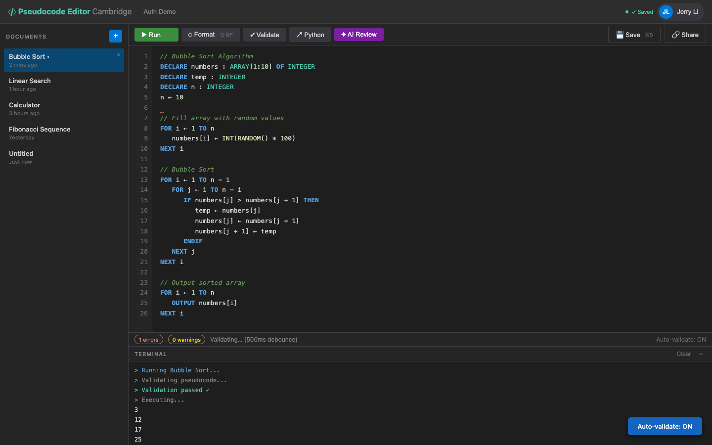

# US-4.3 · Real-time validation as I type
**As a** student,
**I want** the editor to validate my code as I type (after a short pause),
**so that** I get immediate feedback without pressing a button.

**Acceptance Criteria:**
- [ ] Validation runs automatically 500ms after the user stops typing
- [ ] The validation request is debounced (not sent on every keystroke)
- [ ] If a new keystroke occurs during a pending request, the old request is cancelled
- [ ] Inline markers (squiggles) update automatically after each validation
- [ ] A status indicator shows "Validating..." during the API call
- [ ] Real-time validation can be toggled off in settings

## Backend Requirements

| Endpoints touched | DB impact | Services | Auth |
|---|---|---|---|
| `EXISTING POST /api/pseudocode/validate` | None | Validation service must be **thread-safe** and support mult… | Same as validate endpoint (likely `[Authorize]` after Phase… |

- **API endpoints:** Uses the existing `POST /api/pseudocode/validate` endpoint (see US-4.2).
- **Database:** None.
- **Service layer logic:**
  - Validation service must be **thread-safe** and support multiple concurrent requests.
  - Honor request cancellation (e.g., when the client aborts the request) by respecting the ASP.NET request `CancellationToken` to avoid wasted CPU.
  - Performance target: typical inputs should validate in well under 500ms so the UI feels responsive.
- **Authentication/authorization:** Same as validate endpoint (likely `[Authorize]` after Phase 2).
- **Error handling / status codes:**
  - `200 OK` always returns a `ValidationResult` (even when invalid)
  - `400 Bad Request` only for malformed requests (missing/empty `content`)

**Traces to:** FR-2.7, Task 4.3

## Screenshot

