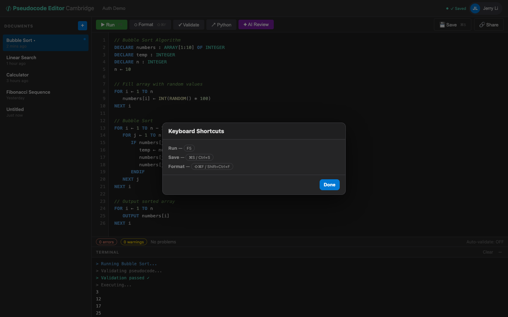

# US-4.4 · Keyboard shortcuts
**As a** student,
**I want to** use keyboard shortcuts for common actions,
**so that** I can work faster without reaching for the mouse.

**Acceptance Criteria:**
- [ ] `Ctrl+S` (or `Cmd+S` on Mac) saves the document
- [ ] `Ctrl+Shift+F` formats the code
- [ ] `F5` runs the code
- [ ] `Ctrl+Z` / `Ctrl+Y` undo/redo work in the editor
- [ ] Shortcuts do not conflict with browser defaults (e.g. Ctrl+S does not trigger browser save dialog)
- [ ] A keyboard shortcut reference is accessible via `Ctrl+/` or from the Help menu

## Backend Requirements

| Endpoints touched | DB impact | Services | Auth |
|---|---|---|---|
| `EXISTING POST /api/pseudocode`; `EXISTING PUT /api/pseudocode/{id}`; `EXISTING POST /api/pseudocode/format`; `NEW POST /api/pseudocode/execute` | None specific to shortcuts | Save/update operations should remain idempotent and return… | After Phase 2, document + utility endpoints should generall… |

- **API endpoints:** No new endpoints; this story triggers existing operations.
  - Save: `POST /api/pseudocode` (create) and `PUT /api/pseudocode/{id}` (update)
    - Requests must use `{ "title": string, "content": string, "language"?: string }` (not `{ code: ... }`).
  - Format: `POST /api/pseudocode/format` (see US-4.1)
  - Run: `POST /api/pseudocode/execute` (new; see Phase 3 / US-3.1)
- **Database:** None specific to shortcuts.
- **Service layer logic:**
  - Save/update operations should remain idempotent and return the persisted document so the client can update timestamps/content.
  - If the backend auto-formats on save (current behaviour), ensure the response contains the stored (formatted) `content`.
- **Authentication/authorization:**
  - After Phase 2, document + utility endpoints should generally be `[Authorize]` and scoped to the authenticated user.
- **Error handling / status codes:**
  - `404 Not Found` for save/update targeting unknown IDs
  - `401 Unauthorized` when protected and token missing/invalid

**Traces to:** Task 4.4

## Screenshot

