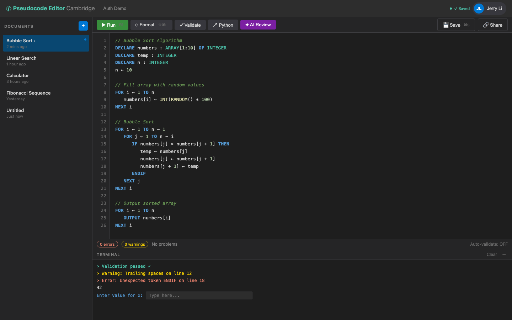

# US-4.5 · Colour-coded terminal output
**As a** student,
**I want** errors to show in red, warnings in yellow, and success in green in the terminal,
**so that** I can quickly scan the output and find problems.

**Acceptance Criteria:**
- [ ] Lines containing "Error" or starting with error indicators show in red (#F48771)
- [ ] Lines containing "Warning" show in yellow (#FFD700)
- [ ] Success messages (e.g. "Validation passed", "Program finished") show in green (#4EC9B0)
- [ ] Normal OUTPUT shows in white/light grey (#D4D4D4)
- [ ] A "Clear" button in the terminal header clears all output
- [ ] The terminal auto-scrolls to the bottom on new output
- [ ] Each execution group is visually separated (e.g. with a horizontal rule or timestamp)

## Backend Requirements

| Endpoints touched | DB impact | Services | Auth |
|---|---|---|---|
| `EXISTING POST /api/pseudocode/validate`; `NEW POST /api/pseudocode/execute` | None | Prefer emitting machine-readable severity/kind rather than… | Same as the underlying endpoints (likely `[Authorize]` afte… |

- **API endpoints:** No new endpoints, but responses must be structured/consistent so the frontend can colorize.
  - Validation: `POST /api/pseudocode/validate` returns `errors[]` and `warnings[]` (see US-4.2). The UI can map `errors` → red and `warnings` → yellow.
  - Execution: `POST /api/pseudocode/execute` (new; see US-3.1) should return structured `events` with `kind` (`output`/`error`/`system`) so the UI can colorize without brittle string matching.
- **Database:** None.
- **Service layer logic:**
  - Prefer emitting machine-readable severity/kind rather than only human-readable strings.
  - Include line numbers on error events so the UI can link terminal items back to editor lines.
- **Authentication/authorization:** Same as the underlying endpoints (likely `[Authorize]` after Phase 2).
- **Error handling / status codes:**
  - For user-code/runtime errors, prefer `200 OK` with structured error events (not `500`).

**Traces to:** Task 4.5

## Screenshot

