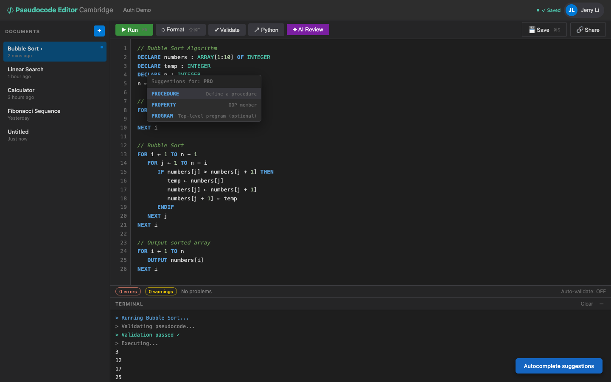

# US-4.6 · Keyword auto-completion
**As a** student,
**I want** the editor to suggest pseudocode keywords as I type,
**so that** I don't have to remember exact spelling and can code faster.

**Acceptance Criteria:**
- [ ] Typing the first 2+ characters of a keyword triggers an autocomplete dropdown
- [ ] The dropdown includes all Cambridge keywords: IF, THEN, ELSE, ENDIF, FOR, NEXT, WHILE, ENDWHILE, etc.
- [ ] Selecting a suggestion inserts the full keyword in UPPERCASE
- [ ] Block keywords insert a template: e.g. selecting "IF" inserts `IF \n   THEN\n   \nENDIF`
- [ ] Autocomplete works alongside Monaco's built-in features (bracket matching, etc.)
- [ ] Autocomplete can be dismissed with Escape

## Backend Requirements

| Endpoints touched | DB impact | Services | Auth |
|---|---|---|---|
| — | None | Keep the canonical Cambridge keyword list centralized so ba… | — |

- **API endpoints:** None.
- **Database:** None.
- **Service layer logic:**
  - Keep the canonical Cambridge keyword list centralized so backend services (validation/formatting/execution) and frontend completion lists stay consistent.
  - Validation/formatting should recognize the same keywords the UI suggests (helps reduce false positives in validation).
- **Authentication/authorization:** N/A.
- **Error handling / status codes:** N/A.

**Traces to:** FR-1.3, Task 4.6

## Screenshot

