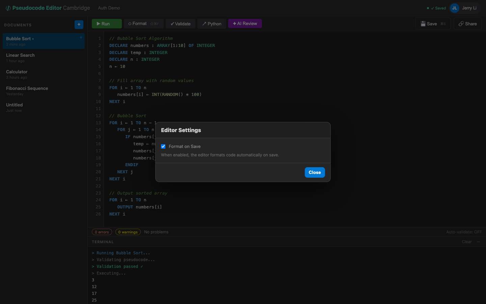

# US-4.7 · Format on save
**As a** student,
**I want** the option to auto-format my code every time I save,
**so that** my code is always correctly formatted without an extra step.

**Acceptance Criteria:**
- [ ] A "Format on Save" toggle is available in a settings panel or menu
- [ ] When enabled, saving (Ctrl+S or Save button) formats the code before sending to the server
- [ ] The setting is persisted in localStorage
- [ ] Default is OFF (format on save must be explicitly enabled)
- [ ] A notification briefly shows "Formatted and saved" when both actions occur

## Backend Requirements

| Endpoints touched | DB impact | Services | Auth |
|---|---|---|---|
| `EXISTING POST /api/pseudocode/format`; `EXISTING POST /api/pseudocode`; `EXISTING PUT /api/pseudocode/{id}` | None (this story persists the setting in `localStorage`) | The backend may still auto-format on create/update (current… | After Phase 2, document endpoints should be `[Authorize]` a… |

- **API endpoints:** No new endpoints.
  - Format: `POST /api/pseudocode/format` (see US-4.1)
  - Save: `POST /api/pseudocode` and `PUT /api/pseudocode/{id}` (document CRUD)
    - Requests must use `{ "content": string }` (not `{ code: ... }`).
- **Database:** None (this story persists the setting in `localStorage`).
- **Service layer logic:**
  - The backend may still auto-format on create/update (current behaviour); formatting should be idempotent so client-side pre-formatting does not cause unexpected diffs.
  - Ensure the returned document `content` matches what is persisted (post-format).
- **Authentication/authorization:** After Phase 2, document endpoints should be `[Authorize]` and scoped to the authenticated user.
- **Error handling / status codes:**
  - `400 Bad Request` for invalid save payloads
  - `401 Unauthorized` if protected and token missing/invalid

**Traces to:** FR-3.2, Task 4.7

## Screenshot

